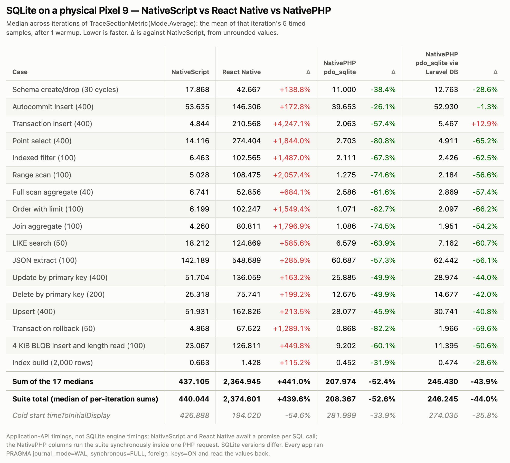

# Pixel 9 comparison, measured with Jetpack Macrobenchmark

A second device alongside [RESULTS-PIXEL7.md](RESULTS-PIXEL7.md), measured with a different harness:
instead of one manual run per app, each app/mode is driven by
[Jetpack Macrobenchmark](https://developer.android.com/topic/performance/benchmarking/macrobenchmark-overview)
over 5 cold-start iterations, and every timed sample is wrapped in an `android.os.Trace`
section that Macrobenchmark reads back. The point of the harness is that anyone can re-run
it on their own device with one command and get per-iteration numbers instead of a single
sample — see [Reproducing](#reproducing).

Measured 2026-09-25 on a physical Pixel 9 (`tokay`), Android 17 / API 37, arm64-v8a, not
rooted. All three release APKs were built from this repository; the workload, fixture and
per-case checks are unchanged.

## Read this before quoting the table

**The NativePHP columns do not have a per-call boundary and the two JavaScript columns do.**
NativeScript and React Native `await` a promise for every SQL call. NativePHP's "PHP loop"
mode runs the whole 17-case suite synchronously inside one PHP request on the persistent PHP
thread, so it pays no per-call scheduling cost. RESULTS-PIXEL7.md excludes this mode for
exactly that reason, and that exclusion is reasonable.

It is included here because it answers a different question — *what does SQLite cost a
NativePHP app that is already running PHP?* — not because it is a like-for-like comparison
with an awaited JavaScript call. These are **application-API timings, not SQLite engine
timings.** The `via Laravel DB` column is the one a real Laravel app actually exercises
(`DB::connection()->statement()` / `select()`), with identical SQL and counts.

NativePHP's SuperNative and per-query WebView modes, which *do* have a per-call boundary,
were not re-run here; RESULTS-PIXEL7.md still has those numbers.

## Results



| Case | NativeScript | React Native | Δ | NativePHP pdo_sqlite | Δ | NativePHP pdo_sqlite via Laravel DB | Δ |
| --- | ---: | ---: | ---: | ---: | ---: | ---: | ---: |
| Schema create/drop (30 cycles) | 17.868 | 42.667 | +138.8% | 11.000 | -38.4% | 12.763 | -28.6% |
| Autocommit insert (400) | 53.635 | 146.306 | +172.8% | 39.653 | -26.1% | 52.930 | -1.3% |
| Transaction insert (400) | 4.844 | 210.568 | +4,247.1% | 2.063 | -57.4% | 5.467 | +12.9% |
| Point select (400) | 14.116 | 274.404 | +1,844.0% | 2.703 | -80.8% | 4.911 | -65.2% |
| Indexed filter (100) | 6.463 | 102.565 | +1,487.0% | 2.111 | -67.3% | 2.426 | -62.5% |
| Range scan (100) | 5.028 | 108.475 | +2,057.4% | 1.275 | -74.6% | 2.184 | -56.6% |
| Full scan aggregate (40) | 6.741 | 52.856 | +684.1% | 2.586 | -61.6% | 2.869 | -57.4% |
| Order with limit (100) | 6.199 | 102.247 | +1,549.4% | 1.071 | -82.7% | 2.097 | -66.2% |
| Join aggregate (100) | 4.260 | 80.811 | +1,796.9% | 1.086 | -74.5% | 1.951 | -54.2% |
| LIKE search (50) | 18.212 | 124.869 | +585.6% | 6.579 | -63.9% | 7.162 | -60.7% |
| JSON extract (100) | 142.189 | 548.689 | +285.9% | 60.687 | -57.3% | 62.442 | -56.1% |
| Update by primary key (400) | 51.704 | 136.059 | +163.2% | 25.885 | -49.9% | 28.974 | -44.0% |
| Delete by primary key (200) | 25.318 | 75.741 | +199.2% | 12.675 | -49.9% | 14.677 | -42.0% |
| Upsert (400) | 51.931 | 162.826 | +213.5% | 28.077 | -45.9% | 30.741 | -40.8% |
| Transaction rollback (50) | 4.868 | 67.622 | +1,289.1% | 0.868 | -82.2% | 1.966 | -59.6% |
| 4 KiB BLOB insert and length read (100) | 23.067 | 126.811 | +449.8% | 9.202 | -60.1% | 11.395 | -50.6% |
| Index build (2,000 rows) | 0.663 | 1.428 | +115.2% | 0.452 | -31.9% | 0.474 | -28.6% |
| **Sum of the 17 medians** | **437.105** | **2,364.945** | **+441.0%** | **207.974** | **-52.4%** | **245.430** | **-43.9%** |
| **Suite total (median of per-iteration sums)** | **440.044** | **2,374.601** | **+439.6%** | **208.367** | **-52.6%** | **246.245** | **-44.0%** |
| Cold start timeToInitialDisplay | 426.888 | 194.020 | -54.6% | 281.999 | -33.9% | 274.035 | -35.8% |

Each cell is the median across the 5 iterations of `TraceSectionMetric(Mode.Average)` — the
mean of that iteration's 5 timed samples, after 1 untimed warmup. Δ is against NativeScript,
from unrounded values; positive means slower. Times are milliseconds.

Two totals are given because they are different statistics and the difference is easy to
misread: **Sum of the 17 medians** adds the column exactly as printed, while **Suite total**
is the median across iterations of each iteration's own total. They differ by a few percent
whenever a case's slow iteration is not the same iteration as another case's.

NativePHP with stock `pdo_sqlite` is faster than NativeScript on all 17 cases and about half
the suite total; through Laravel's DB connection it is faster on 16 of 17 (transaction insert
is +12.9%). React Native (nitro-sqlite `executeAsync`) is the slowest here by a wide margin,
consistent with RESULTS-PIXEL7.md's ordering but much further behind than on the Pixel 7 —
see the caveats.

## Why React Native is so much further behind here than on the Pixel 7

Point select is 274 ms here against 98 ms in RESULTS-PIXEL7.md, so this looks like a device
interaction rather than a SQLite result. Inspecting one `point_select` sample from this run's
own Perfetto trace (`scripts/macro/trace_inspect.py`) shows what dominates it:

| App | Timed thread | CPU placement during the sample | Other app slices inside the sample |
| --- | --- | --- | ---: |
| React Native | `mqt_v_js` | 58% little, 42% mid, 0% big (the three `nitro-thread-*` workers: 100% little) | 3,437 |
| NativeScript | `rk.nativescript` | 22% little, 69% mid, 9% big | 72 |
| NativePHP | `pool-4-thread-1` | 0% little, 100% mid, 0% big | 0 |

React Native's 3,437 inner slices are almost entirely thread lifecycle: `Thread birth`,
`Thread::Attach`, `ThreadList::Register` and `InitTlsEntryPoints` each appear **398 times in a
single 400-query sample**. nitro-sqlite's `executeAsync` path is attaching a fresh ART thread
per query on this device, and those threads are scheduled on the little cores. That is a
property of that library's async path on a Tensor G4, not of SQLite, so **treat the React
Native column as device-specific** rather than as a portable ranking.

The NativePHP row also shows the trace instrumentation costs nothing inside the timed region:
zero other slices, because the begin/end pair sits outside the per-query loop.

## Run-to-run spread

Clocks are unlocked on a non-rooted phone, so treat differences under ~10% as noise. Per
iteration, the sum of the 17 case values:

| App / mode | trace sum per iteration (ms) | (max−min)/median |
| --- | --- | ---: |
| NativeScript | 390.6, 458.7, 417.9, 440.0, 546.7 | 35.5% |
| React Native | 2,361.7, 2,380.7, 2,374.6, 2,586.4, 2,306.2 | 11.8% |
| NativePHP · pdo_sqlite | 206.5, 207.1, 236.7, 210.8, 208.4 | 14.5% |
| NativePHP · pdo_sqlite via Laravel DB | 254.2, 264.6, 245.6, 246.2, 245.1 | 8.0% |

NativeScript's 35.5% is one slow iteration (546.7 ms) against four in the 390–460 ms band;
its median is unaffected but single-run numbers for it should be treated with caution.

## Two independent sessions

The same APKs were measured twice on the same phone, about six hours apart, by two separate
runs of the harness. Suite totals (median of per-iteration sums, ms):

| App / mode | 12:11 session | 18:01 session | change |
| --- | ---: | ---: | ---: |
| NativeScript | 441.7 | 440.0 | −0.4% |
| React Native | 2,183.3 | 2,374.6 | +8.8% |
| NativePHP · pdo_sqlite | 217.0 | 208.4 | −4.0% |
| NativePHP · via Laravel DB | 251.8 | 246.2 | −2.2% |

Every mode reproduced inside its own run-to-run spread, and the ordering is identical. Both
sessions are in `results/pixel9/macro/`. The second session ran on a cooler, fully charged
phone (28–31 °C vs 35–37 °C), which is the likely source of the small across-the-board
improvement for everything except React Native.

## Validity checks

Every app, every iteration: `PRAGMA journal_mode` read back `wal`, `PRAGMA synchronous` read
back `2` (`FULL`), `foreign_keys=ON`, 2,000 fixture rows, `PRAGMA integrity_check` returned
`ok`, and all 17 cases passed. That is 20/20 in-app reports across the reported session.
`TraceSectionMetric(Mode.Count)` confirmed 5 captured samples for every case, so no trace
section was dropped.

Battery stayed at 100% and on AC, battery temperature 28.3–31.2 °C, and thermal status was 0
(none) for every test. The harness waits for the device to cool below 36 °C before each app.
Per-test logs are in `results/pixel9/macro/*/device-log.txt`.

## Harness

| | |
| --- | --- |
| Framework | `androidx.benchmark:benchmark-macro-junit4` 1.5.0, UiAutomator 2.3.0, AGP 8.13.2 |
| Mode | `StartupMode.COLD`, `CompilationMode.Full()` (AOT `speed`) for all apps, 5 iterations |
| Metric | `TraceSectionMetric("case:<name>", Mode.Average)` plus `Mode.Count`, and `StartupTimingMetric` |
| Trace source | NativeScript calls `android.os.Trace` via Java interop; React Native uses a 20-line synchronous native module (`BenchTraceModule.kt`); NativePHP uses the bundled `nativephp/mobile-trace` plugin (two bridge calls per sample, ~20–25 µs each) |

One `beginSection`/`endSection` pair wraps each timed sample — never a single query — so the
instrumentation cost is one pair per 30–400 SQL calls. It is negligible everywhere except
possibly `index_create` (~0.5 ms), where it could add a few percent to NativePHP.

## Packages used

| App | Framework packages | SQLite package or path |
| --- | --- | --- |
| NativeScript | `@nativescript/core` 8.9.9; `@nativescript/android` 8.9.2 | `@edusperoni/nativescript-sqlite` 0.0.3 (the repo's pinned PR-7 fork) |
| React Native | `react-native` 0.87.1; `react-native-nitro-modules` 0.37.1; Hermes | `react-native-nitro-sqlite` 9.7.0 |
| NativePHP | `nativephp/mobile` 4.5.2; `nativephp/mobile-ui` 0.4.0; `laravel/framework` 13.33.0; embedded PHP 8.4.25 | Bundled `pdo_sqlite` through Laravel's default SQLite connection |

SQLite versions differ and are reported by each app: NativeScript 3.53.1, React Native 3.49.0,
NativePHP 3.44.2. NativePHP's is the oldest and still posts the lowest times; `json_extract`
shows the widest engine-side spread (142 ms vs 61 ms for identical SQL), which is larger than
any plausible call overhead and so reflects the SQLite builds more than the frameworks.

Builds: NativeScript `build android --release`, React Native `assembleRelease
-PreactNativeArchitectures=arm64-v8a`, NativePHP `native:run android --build=profileable`
(release-optimized, R8-minified, non-debuggable). All three are non-debuggable and carry
`<profileable android:shell="true"/>` so Perfetto can record their trace sections; that flag
has no runtime cost. NativePHP needs a real `NATIVEPHP_APP_VERSION` rather than the default
`DEBUG`, or it re-extracts its whole Laravel bundle on every launch; `scripts/macro/build.sh`
stamps one per build.

## Reproducing

Prerequisites: a connected Android device, the Android SDK, and JDK 21.

```bash
scripts/macro/build.sh                       # rn ns nativephp -> builds/*.apk (bash port of the README's Windows steps)
scripts/macro/macro.sh <SERIAL> 5            # installs, cools between apps, runs all 4 app/modes
python3 scripts/macro/table_png.py results/pixel9/macro/<RUN_TAG>   # -> table.md, table.html, table.png
```

`macro.sh <SERIAL> 5 nativephpPdo` runs a single app/mode. Results land in
`results/pixel9/macro/<RUN_TAG>/`: the Macrobenchmark JSON with per-iteration values for every
metric, the app's own report for each iteration (`inapp-*.json`), two Perfetto traces per test,
and device/battery/thermal logs. `scripts/macro/run-all.sh <SERIAL> 3` does untraced in-app
runs as a cross-check with no Perfetto session active.

The Macrobenchmark project is `macrobenchmark/`; it is standalone and does not affect the app
builds. The NativePHP app gains one local plugin, `nativephp/plugins/mobile-trace`, which is
vendored into this repository and is a no-op off device.
